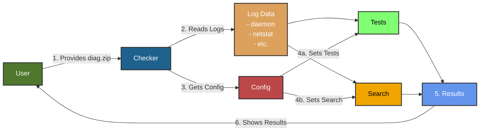

# warp-diag-checker

<p>
  
  <br><br>
  <a href="https://github.com/github/peakefficiency/warp-diag-checker/releases"></a>

  <a href="https://github.com/peakefficiency/warp-diag-checker/actions"></a>
</p>

## General Overview


## Installation

### Mac and Linux

To install on Mac or Linux via Homebrew:

[Requires Homebrew](https://brew.sh/)

```bash {#install-brew}
brew tap peakefficiency/releases
brew install warp-diag-checker
```

To update, run:

```
brew upgrade warp-diag-checker
```

### Windows  

To install on Windows via Chocolatey:

[Requires Chocolatey](https://docs.chocolatey.org/en-us/choco/setup)

```powershell {#install-choco}
choco install warp-diag-checker
```

To update, run:

```
choco upgrade warp-diag-checker
```

### Install issues

As a fallback, you can install from source using:

```
go install github.com/peakefficiency/warp-diag-checker@latest
```
You would need to have Go installed for this

## Usage


Basic usage:

```
warp-diag-checker /path/to/diag.zio
```
